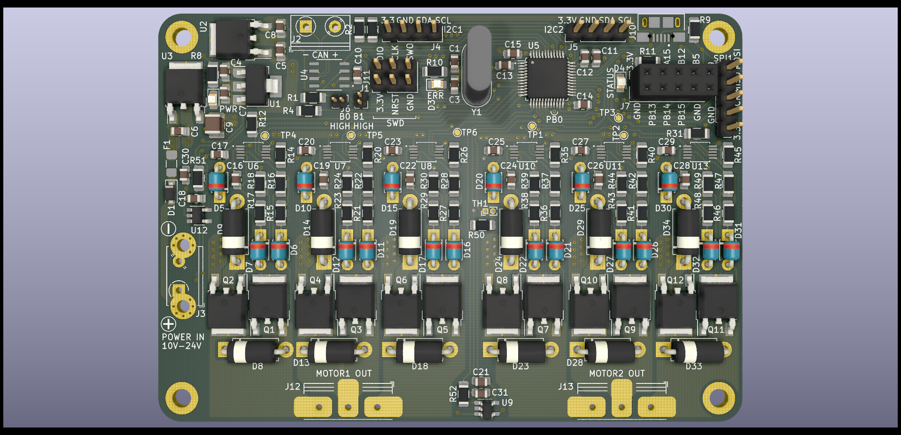

## Actonator - 3D Printable Robot Actuator

3D printable robot actuator with belt-driven gearbox and custom FOC driver board for the used BLDC motor.

### Features
- 12 bit encoder
- Driver Board
  - Input: 10 - 24V
  - Output:
      - Can drive two BLDC motors, each output up to 10A
  - Communication
      - CAN Bus
      - Encoders connected via two I2C connections
          - Alternatively via two SPI inputs
- Gearbox
  - Fully 3d printable
  - 2 stage timing belt based reduction
  - Simple screw-based belt tensioning mechanism

### Project Structure
- `motor_driver/firmware`: C++ firmware code for the stm32 microcontroller
- `motor_driver/can_client_lib` Contains the can bus communication protocol definition and host applications to configure and interface with the motor driver.
    - Here `motorControllerCanProtocol.def.yaml` contains the protocol definition.
- `motor_driver/hardware`: Kicad files with schematics for the board and PCB.
- `motor_driver/hardware/output`: Schematics, board layout and manufacturing files.
- `gearbox`: 3D printing stl files for the gearbox.

### Hardware
This board is a dual channel brushless motor driver.
The design of the board can be found in the `hardware` subfolder.
In `hardware/output` are all generated files for all versions.

For full schematic, see [hardware/motorDriver/output/v0.0.1/schematic.pdf](motor_driver/hardware/output/v0.0.1/schematic.pdf).

### Usage
First look at [README.md](motor_driver/can_client_lib/README.md) to compile the communication lib and host control application.
Then compile and flash the microcontroller firmware, see [README.md](motor_driver/firmware/README.md).